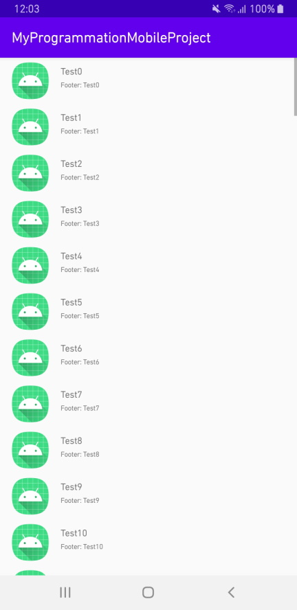
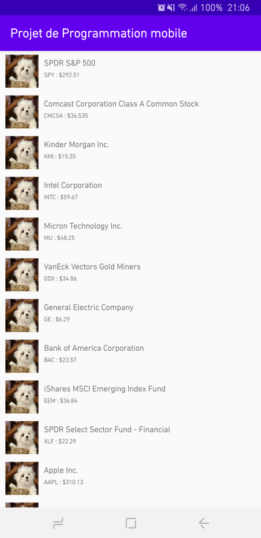
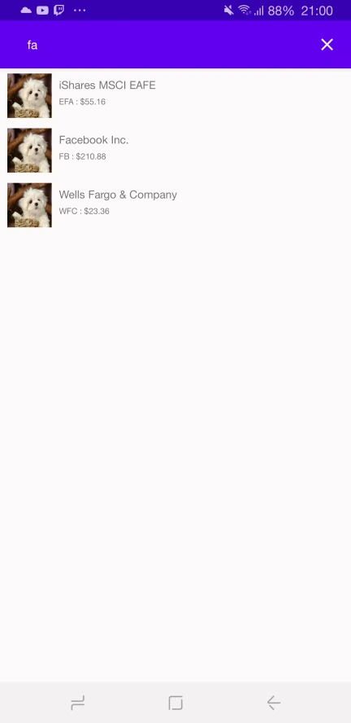

# MyProgrammationMobileProject
Projet de programmation mobile réalisé sous Android Studio.

# Description
~Cette application permettra d'afficher la liste de tous les présidents des principales puissances économiques mondiales.
Un bref historique du président sélectionné sera affiché en récupérant des informations depuis Wikipedia.
Si jamais c'est disponible, un flux Twitter avec leurs derniers tweets sera disponible en dessous de la description.
Enfin, une série de photos sera disponible en bas de page pour chaque président.~

Mes intentions de départ se sont révélées impossibles à réaliser simplement. C'est pourquoi, **je change de projet !**
Cette application affichera toutes les entreprises côtées en bourse et qui sont disponibles sur [Financial Modeling Prep](https://www.financialmodelingprep.com). Une seconde vue se déclenchera à l'appui d'une des compagnies et qui donnera plus d'informations supplémentaires comme une photo, des informations supplémentaires sur la cotation ou un résumé de l'histoire de l'entreprise.

# Fonctionnalités

- RecyclerView pour afficher les éléments
- Swipe to Refresh pour actualiser les données
- Recherche de compagnies (fonctionnalité banale mais sur une liste de 14000 compagnies...)
- API [REST](https://fr.wikipedia.org/wiki/Representational_state_transfer) pour récupérer les données depuis FMP.
- API [Retrofit](https://square.github.io/retrofit/) qui va exploiter l'API REST pour récupérer les données.
- API [Gson](https://github.com/google/gson) qui s'occupe de formater les données dans un format exploitable.
- API [Picasso](https://square.github.io/picasso/) qui récupère les images, les redimensionne et les affiche.
- Cache pour accélérer le lancement de l'application.
- Mode sombre oooo

# Screenshots
|   |   |   |
|---|---|---|
| Capture du 3 avril 2020 - [version initiale](https://github.com/ismaelbalaghni/MyProgrammationMobileProject/commit/7edad8c969512a00153471db6ad93f1c0cf36ab7)  |  Capture du 10 mai 2020 - [liste des compagnies remplie](https://github.com/ismaelbalaghni/MyProgrammationMobileProject/commit/f1b94b21d23fc0b62f710619006f782135a4f4b9) | Capture du 17 mai 2020 - [recherche ajoutée](https://github.com/ismaelbalaghni/MyProgrammationMobileProject/commit/cbecc6bec9fc677fcdc011ded0618efb9d8528da)  |
